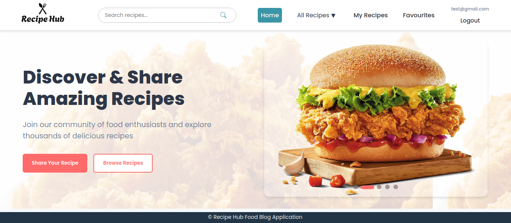
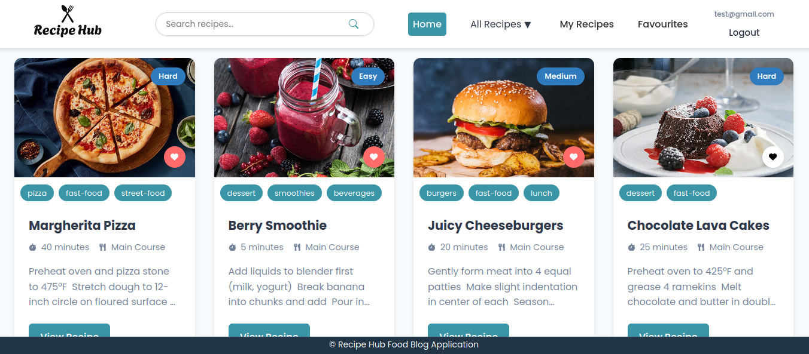

# 🍲 RecipeHub – MERN Food Recipe App

## 🔍 Overview

**RecipeHub** is a feature-rich **MERN stack web app** that allows users to **discover, save, filter, and share** food recipes with ease. Built with **MongoDB, Express, React, and Node.js**, this full-stack application delivers a seamless and responsive user experience for food lovers. Whether you're into quick snacks or gourmet meals, RecipeHub has something for everyone! 👨‍🍳✨

## 🚀 Live Preview

> 🖼️   
> 🖼️ 

## 🌟 Features

- 🔐 **User Authentication** – Sign up, log in, and manage your own recipes securely (JWT-based).
- 📖 **Recipe Discovery** – Browse all recipes or explore by **category**, **difficulty**, or **preparation time**.
- 📝 **Add / Edit / Delete Recipes** – Input title, ingredients, instructions, images & categorize your creations.
- ❤️ **Favorite Recipes** – Mark and manage your favorite recipes with a heart icon.
- 🔍 **Smart Search** – Instantly filter recipes by keyword, even with partial search terms.
- 🧠 **Category Filtering** – Use the dropdown menu to filter recipes like "Fast Food", "Dinner", or "Dessert".
- 📂 **My Recipes Section** – View, edit, or delete only the recipes you've created.
- 🧪 **Unit Testing with Jest** – Ensures core features like adding, editing, and searching are reliable.
- 📱 **Responsive Design** – Fully optimized for **mobile**, **tablet**, and **desktop**.

## 🛠️ Technologies Used

- **Frontend:** React, Tailwind CSS
- **Backend:** Node.js, Express.js
- **Database:** MongoDB (Mongoose)
- **Authentication:** JSON Web Tokens (JWT)
- **Testing:** Jest
- **Other Tools:** React Router, Axios, Cloudinary (for image upload)

## ⚙️ Installation

```bash
# 1. Clone the repo
git clone https://github.com/Milinda55/RecipeHub.git
cd RecipeHub

# 2. Install backend dependencies
npm install

# 3. Navigate to frontend folder and install frontend dependencies
cd frontend
npm install

# 4. Go back to root and start backend server
cd ..
npm run backend

# 5. Start the frontend React app
npm run frontend
```

> 💡 **Ensure you set up your `.env` file** with the necessary **MongoDB** and **JWT** credentials before running the app.

---

## 🧪 Usage Instructions

1. Open the app in your browser at `http://localhost:5000`.
2. Sign up or log in.
3. Explore recipes by title, category, or difficulty.
4. Add your own recipes and manage them in **My Recipes**.
5. Use the ❤️ heart icon to mark recipes as favorites.
6. Test the app's reliability through pre-written unit tests with **Jest**.

---

## 📃 License

This project is licensed under the **MIT License** – see the [LICENSE](LICENSE.txt) file for details.

---

## 🙏 Acknowledgments

- Thanks to open-source contributors and online communities for libraries, icons, and resources.
- Inspired by the love for cooking and the desire to share amazing recipes with others.

